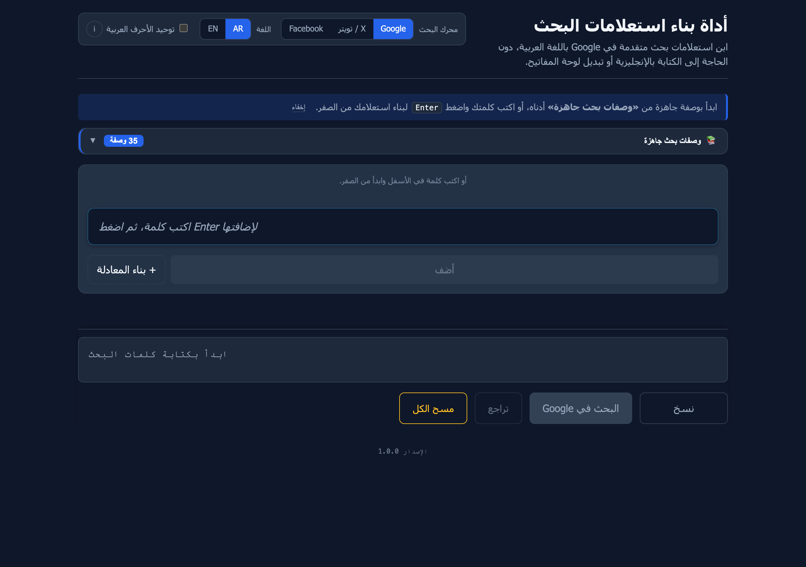
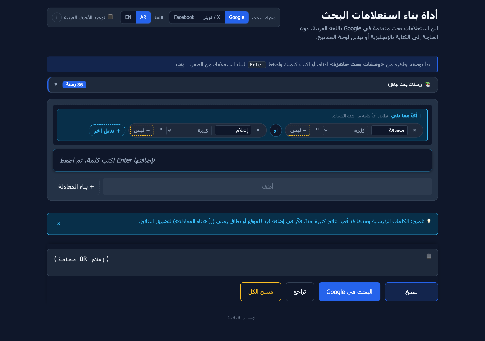
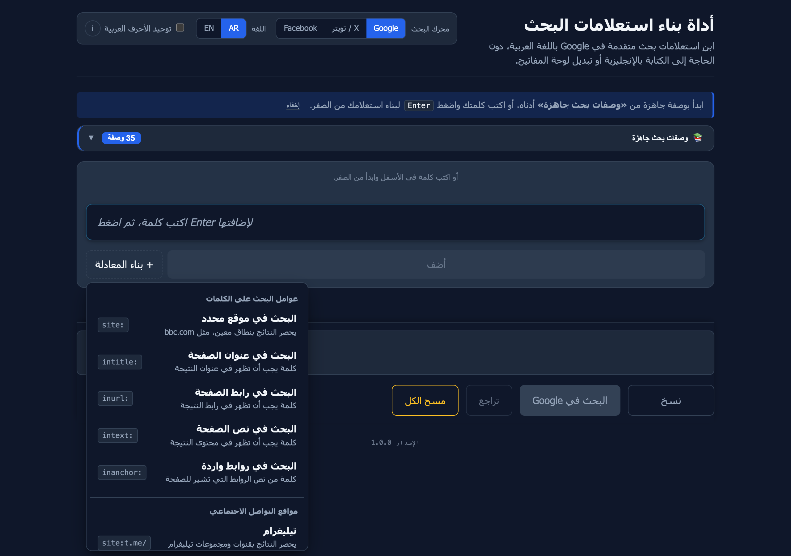
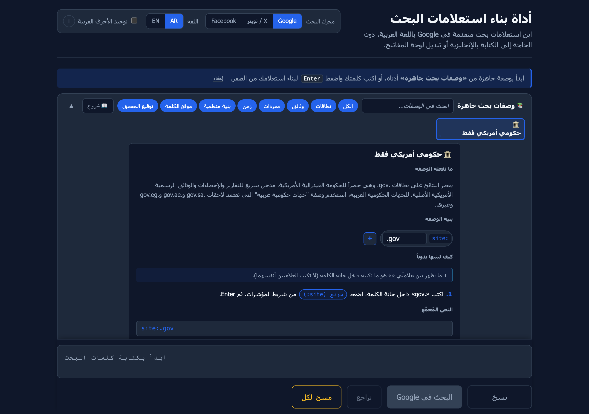
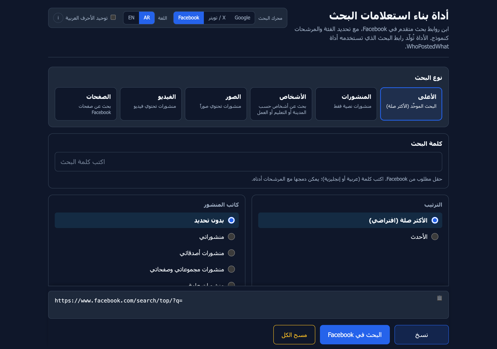
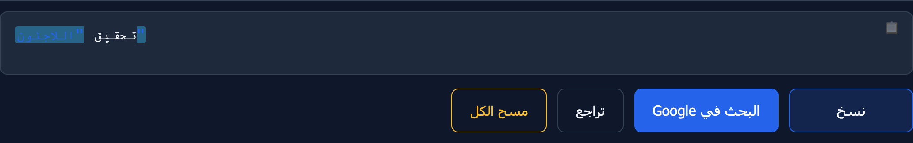
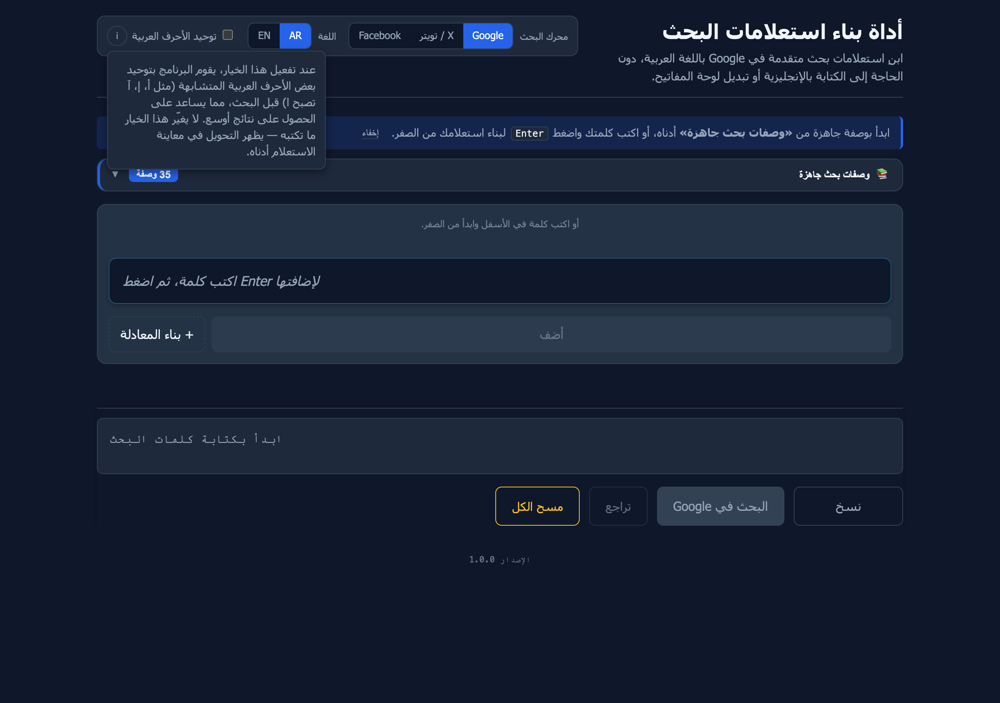

# Search Maker — User Guide

> هذا الدليل متوفر بالعربية أيضاً: [الدليل بالعربية](USER_GUIDE.ar.md)

Search Maker is a tool for building advanced Google, X (Twitter), and Facebook search queries that mix Arabic terms with English-language operators (`site:`, `intitle:`, `filetype:`, date ranges, OR groups, and more) — without the cursor jumps and reordering you get when you type Arabic and Latin in the same field.

Every search term lives in its own chip. Operators are buttons, not characters you type. The full query assembles itself in a read-only preview at the bottom of the screen, so you always see exactly what will be sent.

---

## Contents

- [What you need](#what-you-need)
- [Open the tool](#open-the-tool)
- [The page at a glance](#the-page-at-a-glance)
- [Pick a search engine](#pick-a-search-engine)
- [Build a Google or X query](#build-a-google-or-x-query)
  - [Type a word and press Enter](#type-a-word-and-press-enter)
  - [Pick the operator before you commit](#pick-the-operator-before-you-commit)
  - [Quote a phrase](#quote-a-phrase)
  - [Exclude a word](#exclude-a-word)
  - [Group alternatives with OR](#group-alternatives-with-or)
  - [Use the “+ Build operator” drawer](#use-the--build-operator-drawer)
  - [Use a ready-made recipe](#use-a-ready-made-recipe)
  - [Paste an existing query](#paste-an-existing-query)
- [Build a Facebook search](#build-a-facebook-search)
- [The preview, copy, and search row](#the-preview-copy-and-search-row)
- [Arabic character normalization](#arabic-character-normalization)
- [Privacy and persistence](#privacy-and-persistence)
- [Keyboard shortcuts](#keyboard-shortcuts)
- [Troubleshooting](#troubleshooting)

---

## What you need

A modern desktop browser — Chrome, Firefox, Safari, or Edge. Nothing else: no installer, no account, no internet connection beyond the search you eventually trigger yourself.

## Open the tool

Download `search_maker.html` from the [releases page](https://github.com/bhngyn/search-maker/releases) and double-click the file. It opens in your default browser as a single self-contained page.

It also runs from a USB stick or an offline laptop — the file has no external dependencies.

## The page at a glance

The interface is laid out top-to-bottom in a single column, written right-to-left in Arabic.

| Region | What it does |
|---|---|
| **Header** | Title, search-engine toggle (Google / X / Facebook), language toggle (AR / EN), Arabic-normalization toggle |
| **Welcome blurb** | A one-line introduction with a hide link. Reappears after a refresh. |
| **Recipe library** | A collapsible catalogue of 35 ready-made operator recipes per engine (Google and X). Hidden when Facebook is active. |
| **Chip area** | The chips you have built so far. Empty on first paint. |
| **Composer** | The text input where you type each new term, plus the operator pills, modifier buttons, and the **+ Build operator** drawer. |
| **Sticky preview** | The full assembled query, always pinned to the bottom of the viewport. Click it to copy. |
| **Action row** | Copy, Search (in Google / X / Facebook), and Clear all. |

## Pick a search engine

Three buttons live in the header next to the label **محرك البحث** (Search engine).

- **Google** — the default. The chip composer is set up for Google operators.
- **X / تويتر** — the chip composer switches to X’s operator catalogue (`from:`, `to:`, `@user`, `#tag`, `$cashtag`, `lang:`, `near:`, `since:`/`until:`, engagement filters, etc.).
- **Facebook** — the chip composer is replaced by a category-aware form, since Facebook’s filters aren’t a query language.

Switching between Google and X **keeps your chips**. Operators that don’t exist on the new engine fall back to plain keywords visually, so nothing is lost. Switching to Facebook hides the chip area entirely; switching back restores everything.

A page refresh resets the engine to Google.

## Build a Google or X query

### Type a word and press Enter

Click the composer input (the long box that says “اكتب كلمة، ثم اضغط Enter لإضافتها”), type a term, and press **Enter**. A chip appears in the chip area above.

Press Enter again with no text and nothing happens — empty commits are ignored. **Backspace on an empty input** removes the most recent chip.

While you type, the row of pills directly below the input shows you what kind of chip will be created. The active pill — by default **كلمة عادية** (plain word) — controls the operator. The faint chip on the left is a live preview of what will commit on Enter.

### Pick the operator before you commit

The pills under the composer correspond to the most-used operators. Click one and the next chip you commit will use that operator.

- **كلمة عادية** — plain word, no operator.
- **في الموقع** (`site:`) — restrict to a specific domain.
- **`""` اقتباس حرفي** — wrap the term in quotes for an exact-phrase match. Disabled when the active operator can’t be quoted (e.g. `site:`).
- **`−` استبعاد** — the next term will be excluded from results (`-term`).
- **`⫦` بديل (أو)** — the next term will be added as an alternative to the previous chip (an OR group).

The active pill stays highlighted until you click another one or commit a chip. After commit, the pills reset to **كلمة عادية**.

### Quote a phrase

There are three ways to quote a term as a literal phrase:

1. Click the **`""` اقتباس حرفي** pill before pressing Enter.
2. Type the term wrapped in straight quotes — e.g. `"محمد علي"` — and press Enter. The wrapping quotes are stripped and the chip commits as a quoted phrase.
3. After a chip is already in the chip area, click the small `"` button on the chip itself.

Quoted chips have a slightly tinted background so you can see at a glance which terms are in literal-match mode.

### Exclude a word

Two ways:

1. Click the **`−` استبعاد** pill before pressing Enter.
2. Type a leading hyphen — e.g. `-إعلان` — and press Enter. The chip commits with NOT applied and renders with a red border.

You can also toggle NOT on a chip after the fact by clicking the small `−` button on the chip.

### Group alternatives with OR

To say “any of these words”, you build an OR group. The simplest path:

1. Commit the first term as a chip (just type and press Enter).
2. On that chip, click the small **`+ أو`** handle on its leading edge. A new empty chip appears next to it inside a tinted **OR group** container labelled **⫦ أيٌ مما يلي** (any of the following).
3. Type the second term and press Enter.
4. Click **`+ بديل آخر`** at the trailing edge of the group to add a third alternative — and so on.

You can also press **Shift + Enter** in the composer to OR-extend the previous chip in one step.

In the assembled query the group becomes `(term1 OR term2 OR term3)`.

Adjacent chips outside an OR group are joined by an implicit AND — exactly how Google’s parser already behaves. A faint **و** seam is rendered between standalone chips to make this visible; it never affects the final string.

### Use the “+ Build operator” drawer

Click **+ بناء المعادلة** (the dashed button next to the green commit button) to open the operator drawer.

The drawer has two sections:

- **عوامل البحث على الكلمات** — operator-bearing chips. Click one and an empty chip with that operator pre-set is added to the chip area. Type the value into the chip’s text zone.
- **خيارات إضافية** — special chip types: filetype dropdown, date range, proximity (Google), number range (Google), engagement filter (X), tweet-content filter (X).

The drawer closes on outside click and on Escape.

### Use a ready-made recipe

The **OSINT recipe library** sits right above the chip area. By default it is collapsed to a single pill labelled **📚 وصفات بحث جاهزة · 35 وصفة**. Click it to open the catalogue.

The grid has seven thematic rows, five cards per row. The header bar carries a search input, group-filter chips, and a **📖 شروح** toggle that expands every card to show its title, pattern, and a one-line description (a fast scan mode).

Click any card to open its **inspector** directly below it.

The inspector tells you four things:

1. **ما تعنيه الوصفة** — what the recipe is for, in plain Arabic.
2. **بنية الوصفة** — the chips the recipe produces, shown read-only. A small `+` next to each chip lets you add only that one chip if you don’t want the whole recipe.
3. **كيف نبنيها يدوياً** — numbered steps that walk through the same recipe in terms of the composer controls you’d click.
4. **النص المُجمَّع** — the final assembled query the recipe produces.

Two action buttons at the bottom of the inspector:

- **أضِف الوصفة كاملة** — append all of the recipe’s chips to whatever you already have in the chip area.
- **استبدل البحث الحالي** — clear the chip area first, then apply.

Apply lights up a brief outline-flash on the chip area and moves focus back to the composer so you can keep typing. The panel stays open — you can stack two or three recipes in one query.

If a recipe is already fully present in the chip area, the inspector shows a `✓` and the apply button relabels itself to **أضِف مرة أخرى**.

### Paste an existing query

Pasting text that contains structural markers — operators (`site:`, `intitle:`, `before:`, etc.), quoted phrases, the uppercase `OR` keyword, parentheses, `AROUND(N)`, `..` ranges, leading `-` — is parsed automatically into chips in one pass.

A small toast at the bottom reads **أُضيفت N كلمة من اللصق — تراجع**. Clicking the **تراجع** link removes those exact chips. The toast fades after about 1.5 seconds.

Plain-text pastes fall through to the browser’s default paste, so the input fills with the text and you commit it like normal.

## Build a Facebook search

When you switch the engine toggle to **Facebook**, the chip area is replaced by a structured form.

Top to bottom:

1. **Category cards** (نوع البحث) — pick one of: الأعلى (top), المنشورات (posts), الأشخاص (people), الصور (photos), الفيديو (videos), الصفحات (pages). The active card glows with a coloured ring.
2. **Required keyword field** (كلمة البحث) — Facebook rejects empty queries, so this field is required. The keyword is sent verbatim, URL-encoded only.
3. **Filter sections** — radio groups specific to the active category. Switching category resets the filter selections, since the available filters are different per category.
4. **Date range** — two HTML5 date pickers wired to Facebook’s `rp_creation_time` filter.

Some filter options need an opaque numeric ID (e.g. a page ID, group ID, location ID, employer ID). When you pick such an option, a small monospace input appears next to it for the ID. The field placeholder shows an example.

The preview area below the form shows the full assembled URL — `https://www.facebook.com/search/{category}/?q={keyword}&epa=FILTERS&filters={base64}`. The URL updates live on every change.

The Arabic-normalization toggle has no effect on Facebook — the keyword is passed through untouched.

## The preview, copy, and search row

The preview at the bottom of the page is read-only and pinned to the viewport. Every change to the chip area (or to the Facebook form) updates it immediately. When you add a chip or focus a chip, the matching part of the preview flashes briefly so you can see which slice of the string belongs to which chip.

Below it, four buttons:

| Button | Action |
|---|---|
| **نسخ** | Copy the full query (or URL, on Facebook) to the clipboard. The button briefly confirms. |
| **البحث في Google / X / Facebook** | Open the search in a new tab. The label updates with the active engine. |
| **تراجع** | Step backwards through chip changes (undo). Cmd/Ctrl + Z works too. |
| **مسح الكل** | Clear all chips. Two-tap confirmation: the first click changes the label to **تأكيد المسح** for three seconds; a second click within that window commits. |

## Arabic character normalization

The header has a small checkbox labelled **توحيد الأحرف العربية** (unify Arabic letters). Click the **i** next to it for an explanation.

When the toggle is **on**, every Arabic-content chip is normalized before the term enters the assembled query:

- Strip diacritics (tashkeel) and tatweel (ـ).
- Unify alef variants — `أ ‎إ ‎آ ‎ٱ` all become `ا`.
- Unify ya variants — `ى` becomes `ي`.
- Convert ta marbuta to ha — `ة` becomes `ه`. (This is the most aggressive substitution and the main reason normalization is opt-in.)

The preview reflects the normalized form, so the contract — what the tool sends — is always visible to you. Operator values that aren’t Arabic-aware (`site:`, `inurl:`, dates, file types, number ranges) pass through untouched.

When normalization is off, your chips are sent verbatim.

## Privacy and persistence

- **Nothing is saved.** No localStorage, sessionStorage, cookies, or IndexedDB. Refresh the page and the tool returns to a blank state. Same after closing the tab.
- **No telemetry, no analytics.** The tool makes zero network requests except the search you explicitly trigger via the search button.
- **No accounts, no sync, no “share this query” feature.** If you want to keep a query, copy it yourself.
- **Works offline.** The shipping artifact is a single self-contained HTML file. You can run it from a USB stick.

These are deliberate constraints, not limitations to fix.

## Keyboard shortcuts

| Key | What it does |
|---|---|
| **Enter** in the composer | Commit the typed term as a chip with the currently-selected operator pill |
| **Shift + Enter** in the composer | OR-extend the previous chip (same as the per-chip `+ أو` handle) |
| **Backspace** in an empty composer | Remove the most recent chip |
| Leading `-` in the composer | Commit the next term with NOT applied |
| Wrapping `"…"` in the composer | Strip the quotes and commit as a quoted (literal-match) chip |
| **Esc** | Close any open popover (drawer, recipe inspector, search input, normalization info) |
| **/** while focus is outside the composer | Focus the recipe library search input (when the panel is open) |
| **Alt + ←** / **Alt + →** on a focused chip | Reorder the chip by ±1 in the chip array |
| **Shift + Click** on a chip | Toggle multi-select; a bulk-actions toolbar appears when at least one chip is selected |
| **Cmd / Ctrl + Z** | Undo the last chip change |

## Troubleshooting

**The cursor jumps when I type a term that mixes Arabic and Latin characters.** That’s the bidi-rendering bug the tool is built to avoid. Don’t mix scripts inside one chip — the term inside a chip should be a single script. Operators are added by clicking pills or drawer items, not by typing them inline.

**My chips disappeared after I refreshed the page.** That’s expected. The tool persists nothing. Build the query again, or paste a previously-copied query into the composer to reconstruct it as chips automatically.

**I switched to X / Twitter and one of my chips lost its operator.** X doesn’t have every Google operator (and vice versa). When you switch engines, chips with operators that don’t exist on the new engine render as plain keywords. The text is preserved; only the operator is dropped. Switching back to the original engine doesn’t restore the operator — re-pick it from the pills or the drawer if you need it.

**Facebook says my search is empty.** Facebook’s `q` parameter is required. Type at least one keyword in the **كلمة البحث** field. The Facebook URL won’t resolve to a result page without it.

**The “Search” button opens but Google / X / Facebook returns nothing.** The query may be over-restricted. Watch for the orange warning banner above the preview — it tells you when the query is too long or has too many operators. Try removing one or two restrictions, or use the recipe library to start from a known-good pattern.

**A chip’s text contains Arabic but the operator is `site:` or `inurl:`.** Google can’t match Arabic in URLs. The chip will show a small warning glyph; click it for a one-tap fix or switch the operator.

**I want to remove the welcome line at the top.** Click **إخفاء** at the end of the line. It disappears for the rest of the session. Refresh to bring it back.

**I copied a long query and pasted it but nothing happened.** Make sure focus is in the composer input. Pasting outside the input doesn’t fire the structural parser.

---

For developers and the design rationale behind every behaviour above, see [CLAUDE.md](../CLAUDE.md). For X-specific operator nuances, see [CLAUDE-X.md](../CLAUDE-X.md).
